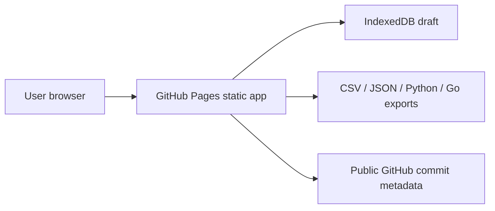

# Paste Scraper Builder


Live site: https://baditaflorin.github.io/paste-scraper-builder/

Repository: https://github.com/baditaflorin/paste-scraper-builder

Support: https://www.paypal.com/paypalme/florinbadita

Paste Scraper Builder turns rendered HTML into repeatable scraper recipes: paste or upload a page, let the app infer records and fields, correct selectors visually when needed, preview the extracted table, then download CSV/JSON or copy Python/Go scraper code.


## Quickstart

```sh
npm install
npm run install-hooks
npm run dev
```

## Verified Features

- Paste rendered HTML, upload/drop an HTML file, read clipboard text, or load the bundled sample.
- Auto-detect common real-page shapes: products, quotes, country listings, Hacker News sibling rows, GitHub Trending repositories, Python.org article lists, arXiv search results, Wikipedia data tables, partial product pages, and challenge/interstitial pages.
- Show inferred field type, confidence, anomalies, and actionable messages before export.
- Resolve relative links against an optional source URL without fetching through CORS.
- Export CSV with optional provenance/confidence columns, project JSON, Python scraper code, and Go scraper code.
- Copy/download active exports, save to IndexedDB, restore drafts, import project JSON, and share small projects via URL hash.
- Show app version, live commit, GitHub repository link, and PayPal support link in the page.

## Checks

```sh
make lint
make test
make build
make smoke
```

## Architecture

Paste Scraper Builder is Mode A: Pure GitHub Pages. It has no runtime backend, no hosted scraping service, and no secrets. Pasted HTML is parsed in the browser, selector rules are stored in IndexedDB, and exports are generated client-side.



Architecture notes: docs/architecture.md

ADRs: docs/adr/

Deploy guide: docs/deploy.md

Privacy: docs/privacy.md

## Limitations

- The app does not fetch URLs. Paste rendered HTML from your browser; this is how it avoids CORS and backend proxy risk.
- It builds one scraper recipe at a time. Multi-file batch scraping is out of scope.
- It does not extract from screenshots, PDFs, or images.
- Generated Python/Go code is a starting point for static HTML with the selected selectors; sites with heavy client rendering may still need browser automation.
- Large project states may be too big for a share URL; use JSON export/import instead.

## Repository Hygiene

GitHub Pages publishes from `main` branch `/docs`. The built Pages directory is intentionally committed. Local hooks live in `.githooks/` and are wired with `make install-hooks`.
