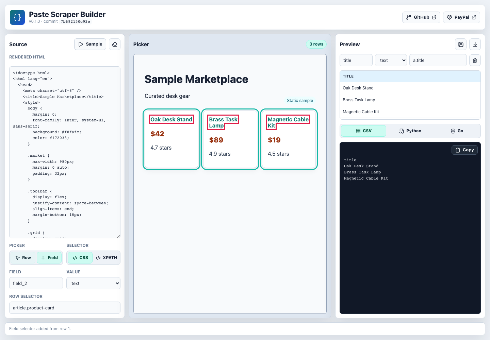
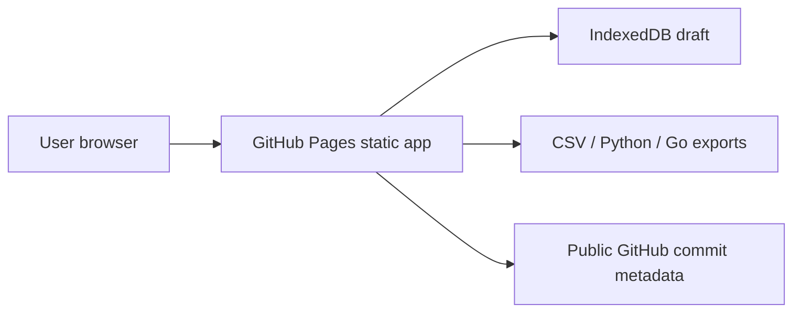

# Paste Scraper Builder


Live site: https://baditaflorin.github.io/paste-scraper-builder/

Repository: https://github.com/baditaflorin/paste-scraper-builder

Support: https://www.paypal.com/paypalme/florinbadita

Paste Scraper Builder turns rendered HTML into repeatable scraper recipes: paste a page, click a repeated row/container, click fields, preview the extracted table, then download CSV or copy Python/Go scraper code.



## Quickstart

```sh
npm install
npm run install-hooks
npm run dev
```

## Checks

```sh
make lint
make test
make build
make smoke
```

## Architecture

Paste Scraper Builder is Mode A: Pure GitHub Pages. It has no runtime backend, no hosted scraping service, and no secrets. Pasted HTML is parsed in the browser, selector rules are stored in IndexedDB, and exports are generated client-side.



Architecture notes: docs/architecture.md

ADRs: docs/adr/

Deploy guide: docs/deploy.md

Privacy: docs/privacy.md

## Repository Hygiene

GitHub Pages publishes from `main` branch `/docs`. The built Pages directory is intentionally committed. Local hooks live in `.githooks/` and are wired with `make install-hooks`.
