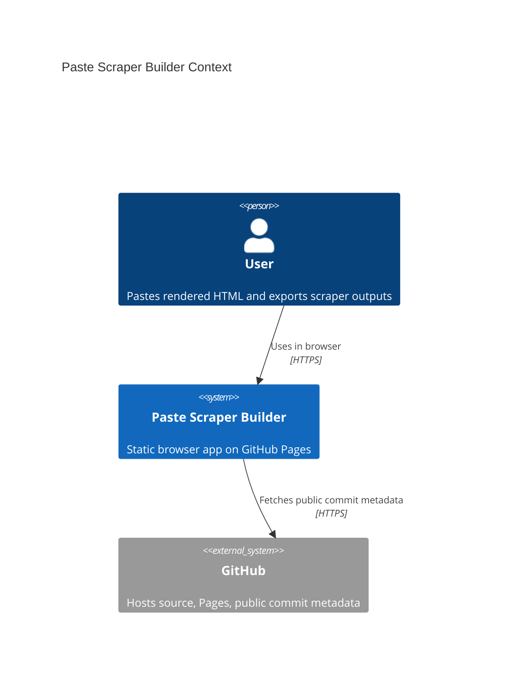
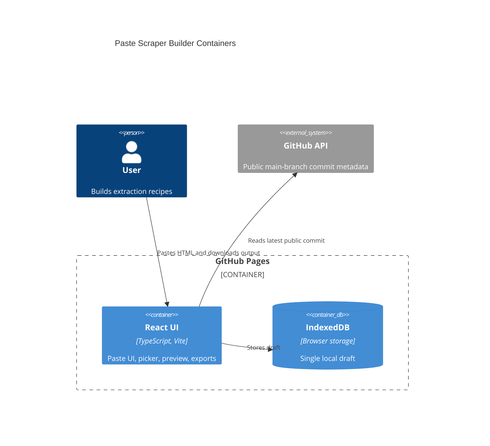

# Architecture

Paste Scraper Builder is a Mode A GitHub Pages application.

```mermaid
C4Context
  title Paste Scraper Builder Context
  Person(user, "User", "Pastes rendered HTML and exports scraper outputs")
  System(app, "Paste Scraper Builder", "Static browser app on GitHub Pages")
  System_Ext(github, "GitHub", "Hosts source, Pages, public commit metadata")
  Rel(user, app, "Uses in browser", "HTTPS")
  Rel(app, github, "Fetches public commit metadata", "HTTPS")
```

```mermaid
C4Container
  title Paste Scraper Builder Containers
  Person(user, "User", "Builds extraction recipes")
  Container_Boundary(pages, "GitHub Pages") {
    Container(ui, "React UI", "TypeScript, Vite", "Paste UI, picker, preview, exports")
    ContainerDb(local, "IndexedDB", "Browser storage", "Single local draft")
  }
  System_Ext(github, "GitHub API", "Public main-branch commit metadata")
  Rel(user, ui, "Pastes HTML and downloads output")
  Rel(ui, local, "Stores draft")
  Rel(ui, github, "Reads latest public commit")
```

The GitHub Pages boundary is explicit: no runtime API, no secrets, and no hosted scraping service.
